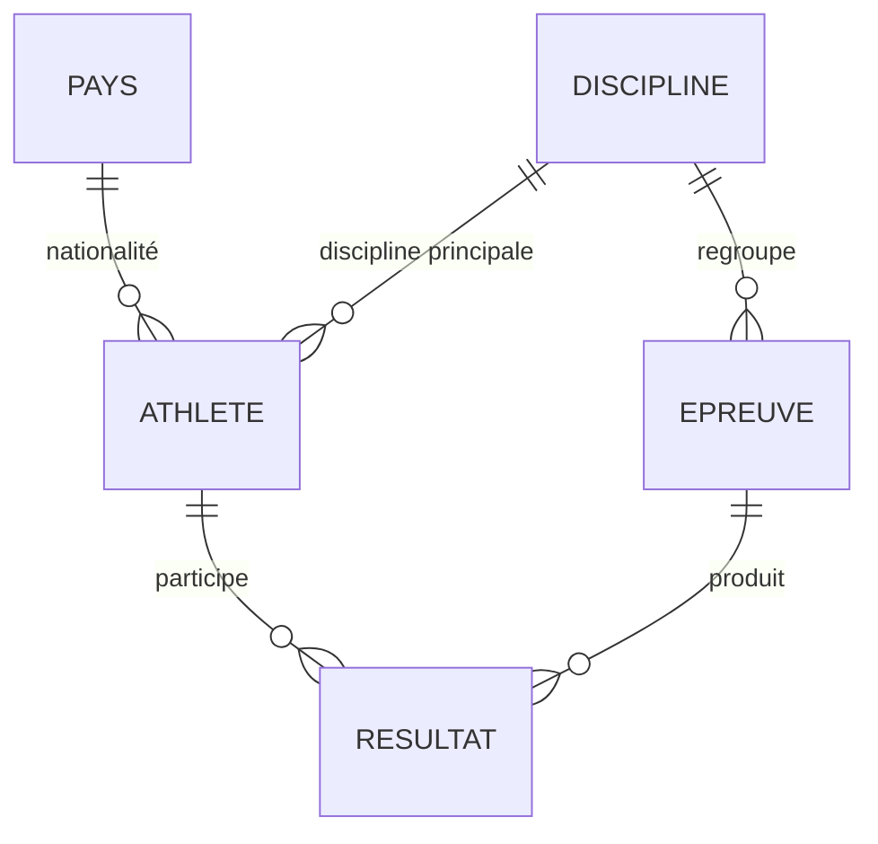
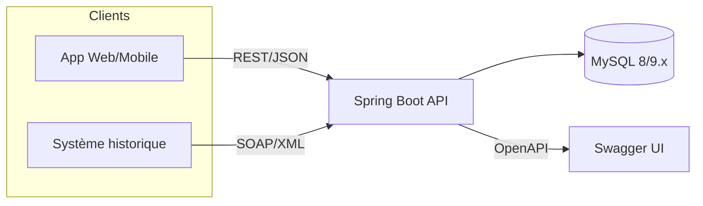

# Olympic Management System — Analyse du projet

> Document d'analyse préalable à toute implémentation.
> Source : `Sujet d'examen M1S2 - 2026 (1).pdf` (Web Services — JO de Dakar).
> Statut : **en attente de validation** — aucun code n'a été écrit à ce stade.

---

## 0. Décisions validées

| # | Sujet | Décision | Détail |
|---|-------|----------|--------|
| 1 | **Délai réel** | **Confirmé : 5 jours** (limite 05/08/2026, aujourd'hui 31/07/2026). | Le plan §12 est resserré en conséquence — scope MVP obligatoire vs scope si temps restant, voir §12. |
| 2 | **Base de données** | **MariaDB 10.4 via XAMPP** (pas MySQL, pas de MySQL 8 installé séparément). | Hibernate doit utiliser `org.hibernate.dialect.MariaDBDialect` (ou dialect auto-détecté par le driver `mariadb-java-client`). Fonctionnellement équivalent à MySQL pour ce périmètre (CRUD, agrégations, jointures) — pas de fonctionnalité MySQL 8-spécifique utilisée dans ce projet. phpMyAdmin déjà inclus dans XAMPP. |
| 3 | **Java 21** | Java 17 (Microsoft build) est la version par défaut sur le PATH. Java 21 (Microsoft build) est installé mais pas actif. | Configurer `JAVA_HOME`/toolchain Maven sur le JDK 21 spécifiquement pour ce projet (ne pas changer le défaut système). |
| 4 | **Docker** | Non installé. | Développement local via XAMPP (MariaDB+phpMyAdmin) sans Docker. Pas de `docker-compose.yml` dans le scope MVP vu la contrainte de temps ; peut être ajouté en bonus si le temps le permet. |
| 5 | **SOAP : approche technique** | **Spring-WS contract-first** (XSD → WSDL généré), pratique standard enseignée en Web Services. | Fallback si le temps manque en phase 4 : JAX-WS contract-last (`@WebService`), plus rapide à mettre en place mais moins "bonnes pratiques". |

---

## 1. Analyse du sujet

**Contexte** : dans le cadre des JO de Dakar, le CIO veut une plateforme exposant des données en temps réel à deux types de consommateurs :
- des applications Web/mobiles via une **API REST** ;
- un système d'information historique legacy consommant **uniquement du SOAP**.

**Objectifs pédagogiques explicites** :
- API REST professionnelle (ressources, URI, verbes HTTP, codes de retour, pagination) ;
- Web service SOAP ;
- Documentation OpenAPI/Swagger ;
- (implicite via stack imposée) tests unitaires JUnit/Mockito, persistance JPA/Hibernate sur MySQL.

**Nature du projet** : examen individuel (ou binôme), sur 3 semaines, avec livrables précis (code GitHub, README, collection Postman, soutenance 5-10 min). C'est un projet évalué — la rigueur sur les bonnes pratiques REST/SOAP compte probablement plus que la richesse fonctionnelle.

---

## 2. Exigences fonctionnelles

Dérivées directement du sujet (page 2) :

1. **Athlètes** — CRUD complet avec distinction explicite : création, **modification partielle** (PATCH) et **modification totale** (PUT), suppression, consultation, **recherche multicritère**.
2. **Disciplines** — CRUD complet + consultation des athlètes d'une discipline.
3. **Épreuves** — CRUD complet + recherche par date + recherche par discipline.
4. **Résultats** — enregistrement des résultats d'une épreuve, **attribution automatique des médailles**, consultation du podium.
5. **Tableau des médailles** — endpoint agrégé Or/Argent/Bronze/Total par nation, classement avec règle de départage olympique (Or, puis Argent si égalité, puis Bronze).
6. **Tableau de bord** — endpoints statistiques : nb total d'athlètes, nb de pays participants, nb de médailles par type, classement des pays par **points** (Or=7, Argent=4, Bronze=1 — **différent** de la règle du tableau des médailles), nb de médaillés par pays.

Fonctionnalités **non explicitement demandées** mais nécessaires pour que le tout tienne (à valider) :
- Gestion des **pays/nations** comme entité propre (nécessaire pour agréger correctement le tableau des médailles et le dashboard — un simple champ texte "nationalité" rendrait les agrégations fragiles).
- Authentification/autorisation : **non demandée** par le sujet, donc hors périmètre par défaut (proposée en option si le temps le permet).

---

## 3. Exigences techniques

**Backend** : Java 21, Spring Boot 3.3+, Maven, Spring Data JPA/Hibernate, MySQL 8 (ou MySQL 9.1 disponible localement), REST, SOAP, Swagger/OpenAPI, JUnit 5, Mockito.

**Frontend** : React + TypeScript, Vite, Tailwind CSS, shadcn/ui, Axios, React Router, TanStack Query, React Hook Form, Zod, Recharts.

**Base de données** : MySQL + phpMyAdmin (pas de PostgreSQL). En pratique sur cette machine : **MariaDB 10.4 via XAMPP** (cf. §0.2) — driver `mariadb-java-client`, dialect Hibernate MariaDB.

**Contraintes qualité issues du sujet** : bonnes pratiques REST (ressources/URI/verbes/codes retour/pagination), documentation OpenAPI, tests, README d'architecture, collection Postman exhaustive.

---

## 4. Entités

### 4.1 `Pays` (Country) — entité de support, non citée explicitement mais nécessaire
| Champ | Type | Contrainte |
|---|---|---|
| id | Long | PK |
| code | String(3) | ISO 3166-1 alpha-3, unique, requis |
| nom | String | unique, requis |

### 4.2 `Discipline`
| Champ | Type | Contrainte |
|---|---|---|
| id | Long | PK |
| nom | String | unique, requis |
| description | String | optionnel |

### 4.3 `Athlete`
| Champ | Type | Contrainte |
|---|---|---|
| id | Long | PK |
| nom | String | requis |
| prenom | String | requis |
| sexe | Enum {M, F} | requis |
| dateNaissance | LocalDate | requis, doit être dans le passé |
| nationalite | → `Pays` (FK) | requis |
| discipline | → `Discipline` (FK) | requis |
| taille | Integer (cm) | requis, plage plausible (100–250) |
| poids | Double (kg) | requis, plage plausible (20–300) |

### 4.4 `Epreuve` (Event)
| Champ | Type | Contrainte |
|---|---|---|
| id | Long | PK |
| nom | String | requis |
| discipline | → `Discipline` (FK) | requis |
| dateEpreuve | LocalDateTime | requis |
| lieu | String | optionnel |
| statut | Enum {PLANIFIEE, EN_COURS, TERMINEE} | défaut PLANIFIEE |

### 4.5 `Resultat` (Result)
| Champ | Type | Contrainte |
|---|---|---|
| id | Long | PK |
| epreuve | → `Epreuve` (FK) | requis |
| athlete | → `Athlete` (FK) | requis, doit concourir dans la même discipline que l'épreuve |
| performance | String | ex: "9.58s", "8.95m" — format libre selon discipline |
| rang | Integer | requis, ≥ 1 |
| medaille | Enum {OR, ARGENT, BRONZE, null} | **calculé automatiquement**, non saisi par le client |

> Pas d'entité `Medaille` séparée : la médaille est un attribut dérivé de `Resultat.rang`, recalculé côté service. Créer une table dédiée ajouterait de la duplication sans bénéfice pour ce périmètre.

---

## 5. Relations



- `Pays (1) — (N) Athlete`
- `Discipline (1) — (N) Athlete`
- `Discipline (1) — (N) Epreuve`
- `Epreuve (1) — (N) Resultat`
- `Athlete (1) — (N) Resultat`

Contraintes d'intégrité : suppression d'un `Pays`, `Discipline` ou `Epreuve` référencé(e) → **409 Conflict** (RESTRICT), pas de suppression en cascade silencieuse.

---

## 6. Règles métier

1. **Attribution automatique des médailles** : `rang=1 → OR`, `rang=2 → ARGENT`, `rang=3 → BRONZE`, sinon `null`. Recalculée par le service à chaque écriture de résultat dans la même transaction — jamais fournie par le client.
2. **Podium** : les `Resultat` d'une épreuve avec `rang ∈ {1,2,3}`, triés par rang croissant.
3. **Cohérence discipline/athlète** : un résultat ne peut être enregistré pour une épreuve que si `athlete.discipline == epreuve.discipline` (422 sinon).
4. **Deux systèmes de classement distincts** (à ne pas confondre dans l'implémentation) :
   - *Tableau des médailles* (règle olympique) : tri par nb OR desc, puis nb ARGENT desc (égalité), puis nb BRONZE desc (égalité).
   - *Tableau de bord* (règle à points) : score = `nbOR×7 + nbARGENT×4 + nbBRONZE×1`, tri par score desc.
5. **Modification athlète** : `PUT /athletes/{id}` remplace toutes les données modifiables ; `PATCH /athletes/{id}` ne modifie que les champs fournis (merge partiel).
6. **Recherche multicritère athlète** : combinaison optionnelle de nom, prénom, sexe, nationalité, discipline, tranche de date de naissance — tous les critères sont `AND`-combinés et optionnels.
7. **Validation des plages** : taille/poids hors plage plausible → 400 Bad Request avec détail du champ en erreur (format `application/problem+json`, RFC 7807).

---

## 7. Architecture

### 7.1 Vue d'ensemble



### 7.2 Backend — organisation en couches (par souci de simplicité pour un projet M1)

```
backend/
  src/main/java/com/olympic/dakar/
    config/          # Swagger, CORS, exception handler, Spring-WS config
    common/           # DTO génériques (PageResponse, ProblemDetail), enums partagés
    athlete/          # controller, service, repository, entity, dto, mapper
    discipline/
    epreuve/
    resultat/
    pays/
    medaltable/       # service d'agrégation + endpoint dédié
    dashboard/        # endpoints statistiques
    soap/             # endpoint Spring-WS, XSD, générateur WSDL
  src/main/resources/
    application.yml
    xsd/
  src/test/java/...
```

Découpage par **fonctionnalité** (feature package) plutôt que par couche technique globale : plus lisible pour un projet à entités multiples, et chaque package reste petit (adapté M1, pas de sur-ingénierie).

**Choix techniques backend** :
- DTO + mapper dédiés (pas d'exposition directe des entités JPA).
- Validation Bean Validation (`jakarta.validation`) + `@RestControllerAdvice` global → réponses d'erreur RFC 7807.
- Pagination Spring Data (`Pageable`/`Page<T>`) enveloppée dans un `PageResponse` homogène.
- API versionnée : `/api/v1/...`.
- Springdoc-openapi pour Swagger UI (`/swagger-ui.html`, `/v3/api-docs`).

---

## 8. Endpoints REST (draft — base `/api/v1`)

### Athlètes
| Méthode | URI | Description |
|---|---|---|
| GET | `/athletes` | Liste paginée + recherche multicritère via query params (`nom`, `prenom`, `sexe`, `nationalite`, `discipline`, `dateNaissanceMin`, `dateNaissanceMax`, `page`, `size`, `sort`) |
| GET | `/athletes/{id}` | Détail |
| POST | `/athletes` | Création |
| PUT | `/athletes/{id}` | Remplacement total |
| PATCH | `/athletes/{id}` | Modification partielle |
| DELETE | `/athletes/{id}` | Suppression |

### Disciplines
| Méthode | URI | Description |
|---|---|---|
| GET | `/disciplines` | Liste |
| GET | `/disciplines/{id}` | Détail |
| POST | `/disciplines` | Création |
| PUT | `/disciplines/{id}` | Modification |
| DELETE | `/disciplines/{id}` | Suppression |
| GET | `/disciplines/{id}/athletes` | Athlètes de la discipline |

### Épreuves
| Méthode | URI | Description |
|---|---|---|
| GET | `/epreuves` | Liste, filtres `date`, `disciplineId` |
| GET | `/epreuves/{id}` | Détail |
| POST | `/epreuves` | Création |
| PUT | `/epreuves/{id}` | Modification |
| DELETE | `/epreuves/{id}` | Suppression |

### Résultats & podium
| Méthode | URI | Description |
|---|---|---|
| POST | `/epreuves/{id}/resultats` | Enregistrer un résultat (déclenche l'attribution médaille) |
| GET | `/epreuves/{id}/resultats` | Tous les résultats de l'épreuve |
| GET | `/epreuves/{id}/podium` | Top 3 |

### Tableau des médailles & dashboard
| Méthode | URI | Description |
|---|---|---|
| GET | `/medailles/tableau` | Classement olympique par pays (Or→Argent→Bronze) |
| GET | `/dashboard/summary` | Totaux athlètes/pays/médailles |
| GET | `/dashboard/classement-points` | Classement pays par points (7/4/1) |
| GET | `/dashboard/medailles-par-pays` | Nb de médaillés par pays |

Codes retour : `200` (lecture), `201` + `Location` (création), `204` (suppression), `400` (validation), `404` (introuvable), `409` (conflit d'intégrité), `422` (règle métier violée, ex. discipline incohérente).

---

## 9. Opérations SOAP (draft)

**Approche** : Spring-WS contract-first (XSD → WSDL auto-généré), endpoint `/ws/olympic`, WSDL exposé en `/ws/olympic.wsdl`.

Le "système historique" étant décrit comme un consommateur de données existantes, les opérations sont orientées **consultation** (miroir en lecture des fonctionnalités REST) :

| Opération | Entrée | Sortie |
|---|---|---|
| `getAthleteById` | id | AthleteDTO |
| `searchAthletes` | critères (nom, discipline, pays...) | liste AthleteDTO |
| `getAthletesByDiscipline` | disciplineId | liste AthleteDTO |
| `getEpreuves` | date?, disciplineId? | liste EpreuveDTO |
| `getResultatsByEpreuve` | epreuveId | liste ResultatDTO |
| `getPodium` | epreuveId | top 3 ResultatDTO |
| `getMedalTable` | — | classement pays (règle olympique) |
| `getDashboardStats` | — | statistiques globales |

---

## 10. Stratégie de tests

- **Unitaires (JUnit 5 + Mockito)** : logique métier isolée — attribution des médailles, calcul du podium, tri du tableau des médailles, calcul du classement par points. Cible prioritaire car ce sont les règles les plus risquées.
- **Slice tests** : `@WebMvcTest` (contrôleurs + validation, MockMvc), `@DataJpaTest` (requêtes de recherche multicritère, base H2 en mémoire).
- **Intégration** : `@SpringBootTest` bout-en-bout avec H2 (MySQL non disponible en CI sans Docker) ; migration vers Testcontainers/MySQL si Docker est installé plus tard.
- **SOAP** : `MockWebServiceClient` (Spring-WS test).
- **Collection Postman** (livrable obligatoire) : couverture de tous les endpoints REST y compris cas d'erreur (400/404/409/422), exportée avec un environnement.
- Cible de couverture pragmatique : ~70-80% sur la couche service, pas de fétichisme du 100%.

---

## 11. Architecture frontend

```
frontend/
  src/
    app/            # providers (QueryClient, Router), layout global
    pages/          # DashboardPage, AthletesPage, DisciplinesPage, EpreuvesPage, MedalTablePage
    features/        # un dossier par domaine : api hooks (TanStack Query), composants métier
      athletes/
      disciplines/
      epreuves/
      resultats/
      dashboard/
    components/ui/   # shadcn/ui
    lib/             # axios instance, config
    schemas/         # zod schemas (miroir des DTO backend)
    routes/          # React Router
```

- **Axios** instance unique avec `baseURL` = variable d'env (`VITE_API_BASE_URL`).
- **TanStack Query** pour tout l'état serveur (pas de state manager global superflu).
- **React Hook Form + Zod** pour les formulaires (Athlète, Discipline, Épreuve, Résultat) — schémas Zod qui reflètent les contraintes des DTO backend.
- **Recharts** pour le dashboard : barres (médailles par pays), classement, éventuellement une timeline des épreuves.
- Pas de gestion d'authentification (hors périmètre, cf. §2).

---

## 12. Plan de développement

**Délai confirmé : 5 jours** (échéance 05/08/2026). L'estimation "confortable" du §ancien (~7-8 j) ne rentre pas telle quelle → plan resserré ci-dessous avec un **socle obligatoire (MVP noté)** et des **extensions si le temps le permet**, journée par journée. Objectif : ne jamais être dans un état "rien ne marche" — chaque jour se termine sur quelque chose de démontrable.

### Socle obligatoire (MVP noté) — doit être fini avant tout le reste

Couvre l'essentiel des objectifs pédagogiques du sujet : REST propre, SOAP fonctionnel, Swagger, tests, Postman, README.

| Jour | Contenu | Sort du jour |
|---|---|---|
| **J1** | Setup (Git, squelette Spring Boot + config JDK 21, DB MariaDB/XAMPP, migration schéma) + entités/repositories + CRUD Athlète/Discipline/Épreuve (PUT/PATCH distincts) + validation + gestion d'erreurs RFC 7807 + pagination | CRUD complet testable via Swagger UI |
| **J2** | Résultats + attribution médailles auto + podium + tableau des médailles (règle olympique) + dashboard (règle points 7/4/1) + recherche multicritère athlètes | Toute la logique métier notée est fonctionnelle |
| **J3** | Module SOAP (Spring-WS, XSD/WSDL, opérations de consultation) + finition Swagger/OpenAPI | REST + SOAP tous deux démontrables |
| **J4** | Tests unitaires (médailles, classements) + tests d'intégration clés + collection Postman complète (CRUD + erreurs) | Suite de tests verte + Postman exportable |
| **J5** | Frontend minimal (Dashboard + liste/CRUD Athlètes au moins) + README final + nettoyage + push GitHub + répétition soutenance | Livrables complets prêts à rendre |

### Extensions (si de l'avance est prise un jour donné)

- Frontend : pages Disciplines/Épreuves/Résultats complètes, graphiques Recharts avancés, UX soignée shadcn/ui.
- Tests : couverture élargie (slice tests contrôleurs/repositories), tests SOAP `MockWebServiceClient`.
- `docker-compose.yml` pour portabilité (nécessite d'abord d'installer Docker).
- Sécurité basique (API key) si jugée utile.

**Règle de décision en cours de route** : si un jour déborde, on coupe d'abord dans les extensions frontend, jamais dans le socle backend (REST+SOAP+médailles+dashboard+tests+Postman), car c'est ce qui est explicitement noté par le sujet.
